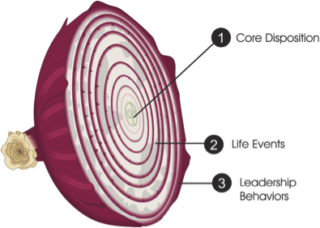

# ycombinator-decorator

Take an action of T: Action<T>.
Say you want to apply a number of other actions before this action, without applying any type of AOP or reflection.

I decided to use Y-Combinator to create a function wrapper which chain each other until finally the original action is called.

Here's the Y-Combinator code:

        static Action<T> Y(Action<T> x, IEnumerable<Action<Action<T>, T>> y)
        {
            if (y.Count() == 0)
                return x;
            return 
                Y(a => y.First()(x, a), y.Skip(1).Take(y.Count() - 1));
        }

We can pass an array of decorators of Action<Action<T>,T> and they will wrapp the original action, and the whole call chain will 
become to look as a sort of onion layers. :) 

And the decorator actions simply look like the following generic log action:

        static Action<Action<T>,T> Log(Action<T> action, T item)
        {
			try
			{
				_logger.Log("Before executing action.")
                action(item);
				_logger.Log("After executing action.")
            catch(Exception ex)
			{
                _logger.Log(ex);
				throw;
			}
        }
		
		
This is prticular suitable for CQR/CQRS command handlers.

This way you can apply type safe AOP without reflection with action decorators.
